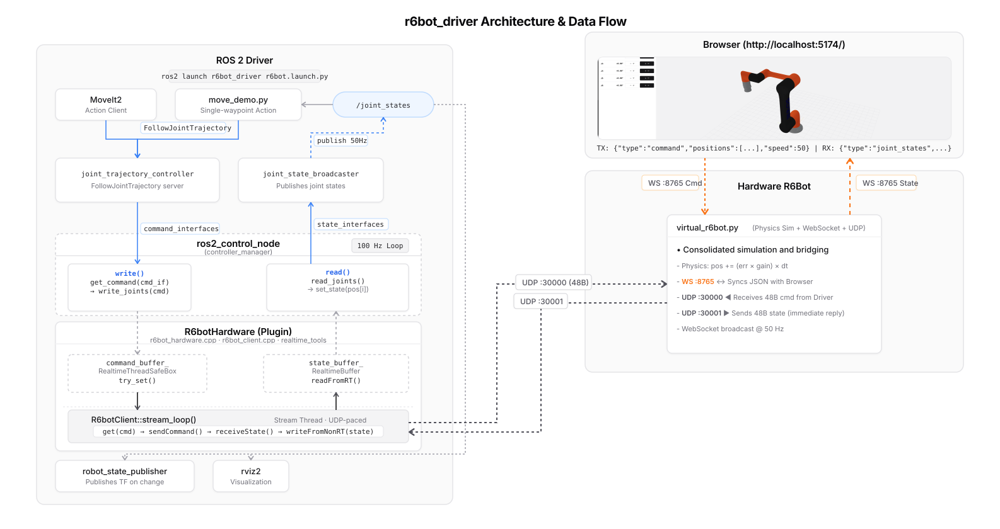

# r6bot — 6-DOF Manipulator Driver

ROS2 Jazzy driver for a 6-DOF robot arm.  Implements the
**continuous streaming** pattern: `read()` and `write()` never block the
control loop — all network I/O runs on a background thread.

<p align="center">
  
</p>

---

## Installation

Install ROS2 control, MoveIt2, CycloneDDS, and the required system tools before
building the workspace:

```bash
source /opt/ros/jazzy/setup.bash
sudo apt update
sudo apt install python3-colcon-common-extensions python3-rosdep python3-websockets nodejs npm
sudo apt install ros-jazzy-ros2-control ros-jazzy-ros2-controllers
sudo apt install ros-jazzy-moveit ros-jazzy-warehouse-ros-sqlite
sudo apt install ros-$ROS_DISTRO-rmw-cyclonedds-cpp
export RMW_IMPLEMENTATION=rmw_cyclonedds_cpp
```

## Quick start — no hardware needed

```bash
# 1. clone and build the workspace
export R6BOT_WS=~/r6bot_ws
mkdir -p "$R6BOT_WS/src"
cd "$R6BOT_WS/src"
git clone https://github.com/m-dear/6dof-manipulator-driver.git r6bot

cd "$R6BOT_WS"
source /opt/ros/jazzy/setup.bash
sudo rosdep init 2>/dev/null || true
rosdep update
rosdep install --from-paths src/r6bot --ignore-src -r -y
colcon build --symlink-install
source install/setup.bash

# 2. start the virtual robot + web dashboard
./src/r6bot/start.sh
# open http://localhost:5173
```

To also run the ROS2 driver against the virtual robot:

```bash
# terminal 2 — after start.sh is running
export R6BOT_WS=~/r6bot_ws
cd "$R6BOT_WS"
source /opt/ros/jazzy/setup.bash
source install/setup.bash
export RMW_IMPLEMENTATION=rmw_cyclonedds_cpp

ros2 launch r6bot_driver r6bot.launch.py
# robot_ip defaults to 127.0.0.1 — matches virtual_r6bot.py
```

Test a trajectory:

```bash
cd "$R6BOT_WS"
source install/setup.bash
ros2 run joint_trajectory_cmd move_demo
```

Launch MoveIt2 (motion planning + RViz):

```bash
cd "$R6BOT_WS"
source install/setup.bash
# terminal 3 — after r6bot_driver is running
ros2 launch r6bot_moveit r6bot_moveit.launch.py
```

---

## What's in this repo

| Path | What it is |
|---|---|
| `virtual_r6bot.py` | Combined physics sim + WebSocket server + UDP server. Replaces physical hardware for development. |
| `start.sh` | Starts `virtual_r6bot.py` + `r6bot_webui` in one command. Checks Node.js/npm and installs web UI dependencies when needed. |
| `r6bot_driver/` | ros2_control hardware interface plugin (`R6botHardware`). UDP protocol, background comm thread, lock-free realtime buffers. |
| `r6bot_moveit/` | MoveIt2 configuration: SRDF, kinematics.yaml (KDL), OMPL planning, controllers. |
| `r6bot_description/` | URDF/xacro robot description and meshes. |
| `r6bot_webui/` | Vite/React/TypeScript web dashboard — 3D view, joint telemetry, jog controls. |
| `joint_trajectory_cmd/` | `move_demo` tool: sends a two-waypoint trajectory to demonstrate continuous streaming. |
| `documents/` | Beginner-friendly guide website covering installation, ROS2 Jazzy, ros2_control, and MoveIt2. |

---

## Reference docs

| Topic | Link |
|---|---|
| ros2_control Jazzy | https://control.ros.org/jazzy/index.html |
| MoveIt2 | https://moveit.picknik.ai/main/index.html |

---

## Architecture

```
Browser (http://5173)
  │ WebSocket :8765 JSON
  ▼
virtual_r6bot.py ◄──── UDP :30000 (48B cmd) ──── r6bot_driver
  (physics sim)  ────► UDP :30001 (48B state) ──► r6bot_driver
                                                      │
                                               ros2_control 100 Hz
                                               write() / read()
                                               (never block)
                                                      │
                                             R6botClient stream loop
                                             (background thread)
```

`write()` copies the latest command into a lock-free buffer.
The background stream thread reads that buffer and sends UDP packets
to the robot (or `virtual_r6bot.py`) continuously.

---

## Protocol

```
PC → Robot   COMMAND   48 bytes   6 × double   [ j1 … j6 positions ]
Robot → PC   STATE     48 bytes   6 × double   [ j1 … j6 positions ]
```

`virtual_r6bot.py` implements the same binary protocol as the real robot
controller and replies immediately on each received command packet.

---

## Packages

| ROS2 package | Description |
|---|---|
| `r6bot_driver` | Hardware interface plugin + UDP client |
| `r6bot_moveit` | MoveIt2 config |
| `r6bot_description` | URDF and meshes |
| `joint_trajectory_cmd` | move_demo trajectory tool |


## References

- [`ros-controls/ros2_control_demos`](https://github.com/ros-controls/ros2_control_demos)
- [ros2_control Jazzy documentation](https://control.ros.org/jazzy/index.html)